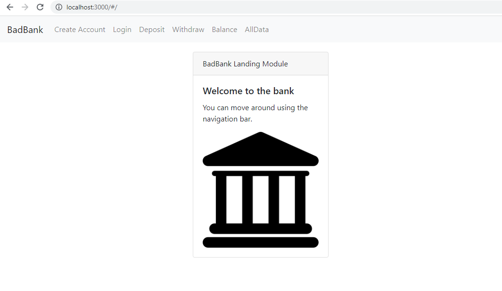

# Bad-Bank

# Project Title: Bad Bank

## Description/Motivation: 

The project is created to learn and demonstrate my skills in react, express, html, css, javascript. It is a good project for beginner to explore the various concepts of a full stack application. 

## Installation Guidelines: Clear instructions on how to get your project up and running (e.g., git clone, git pull, npm init).
1. Download the project to your desktop. If zipped, unzip it. 
2. Run 'npm index.js' on the command prompt 
2. Open http://localhost:3000/ in a browser to open the banking application. You can now explore various links on the navigation bar to explore the features. 

## Installation: 
1. Download the project to your desktop. If zipped, unzip it. 
2. Run 'http-server -c-1' on the command promopt (If you do not have http setup, use npm i http-server to install it.)
2. Open index.html file in a browser by navigating to the location using the URL http://localhost:8080/ to shop.

## Screenshots: 

## Technology used: 
React, Express, Html, CSS, BootStrap, JavaScript

## Features: 
1. React routing to navigate through pages
2. Bootstrap, CSS is used to style the pages

## Support: 
There are many support portals available for JavaScript like MDN, StackOverflow, etc. You can use this forum to research various styles and ask questions.

## Roadmap: 
The future of this project is to add more account handling features like transaction history. 

## License information: 

See MIT license release in repository.
